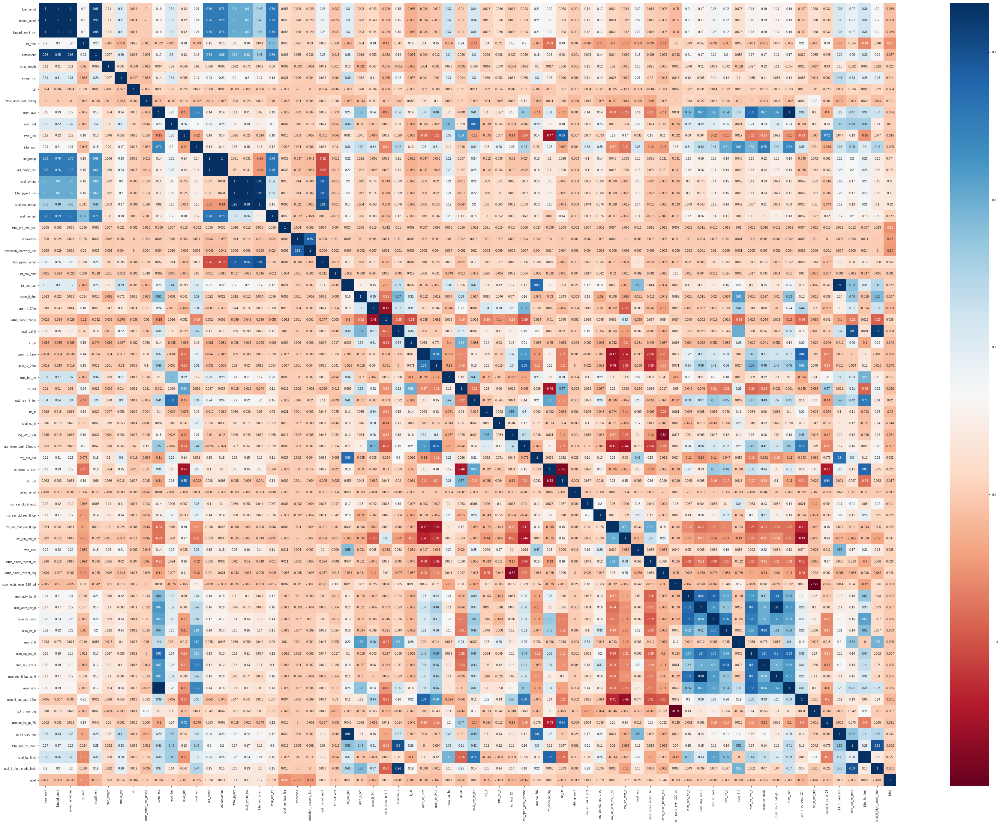
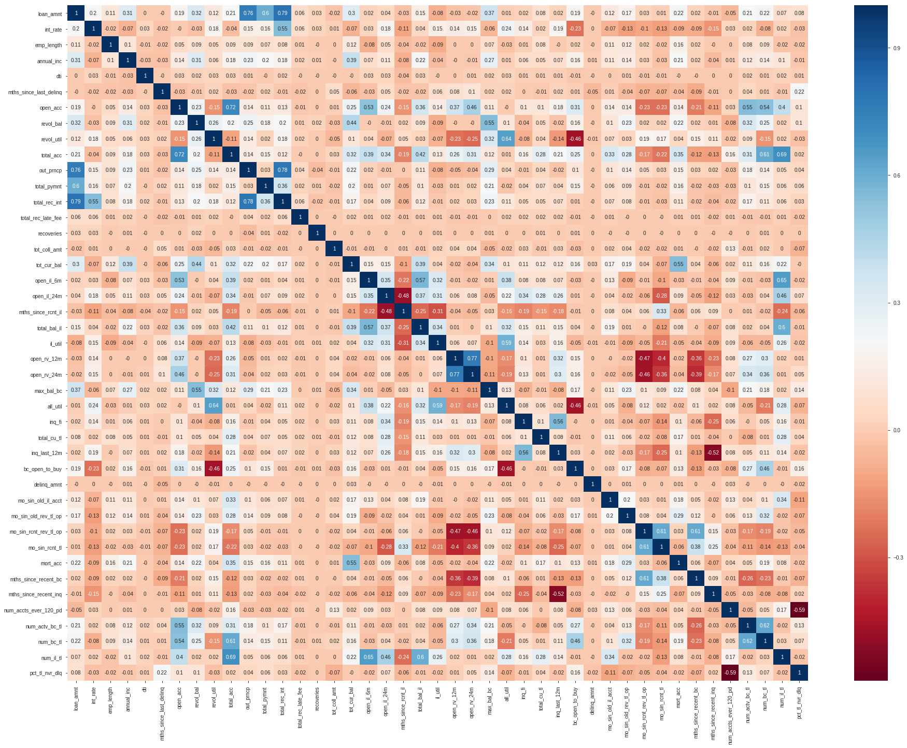
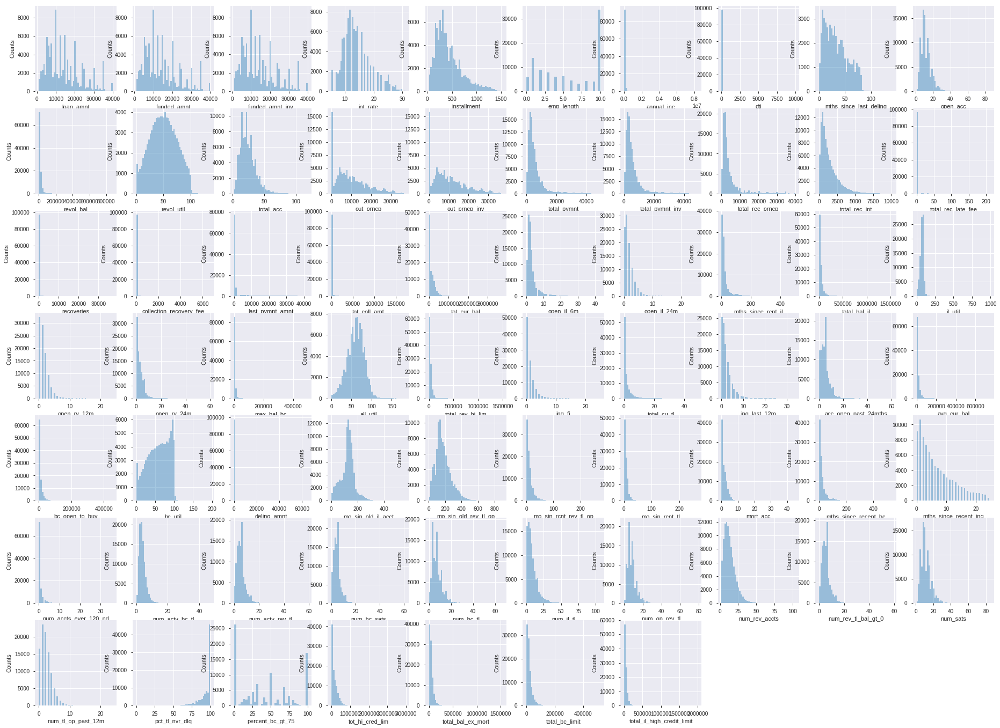
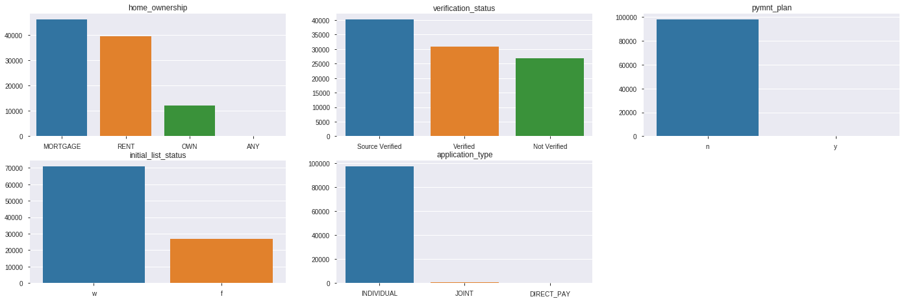
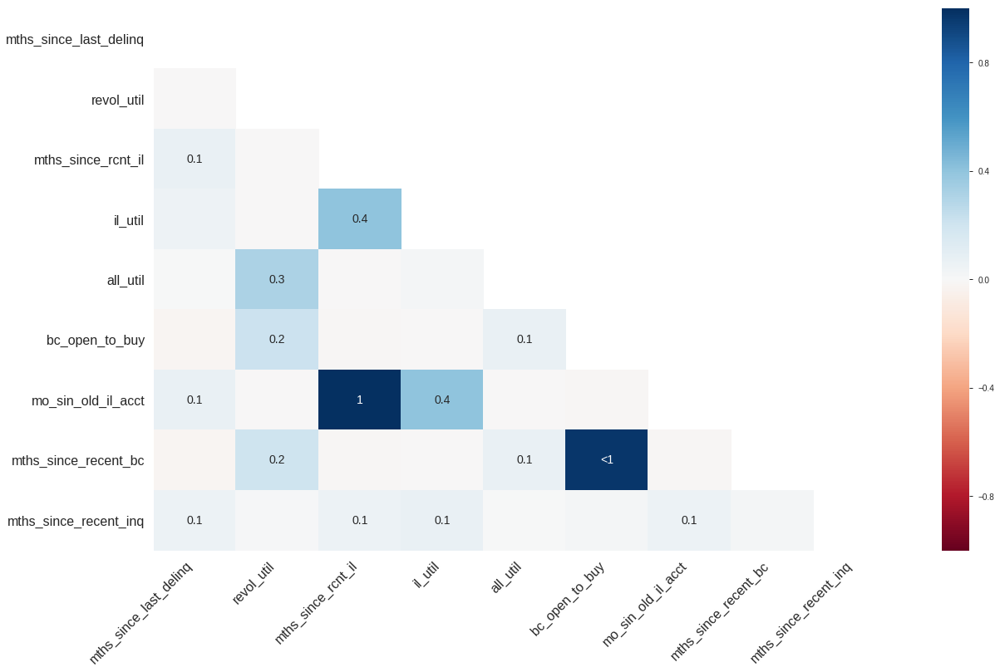
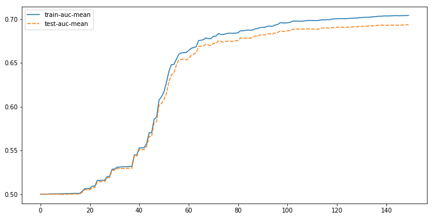
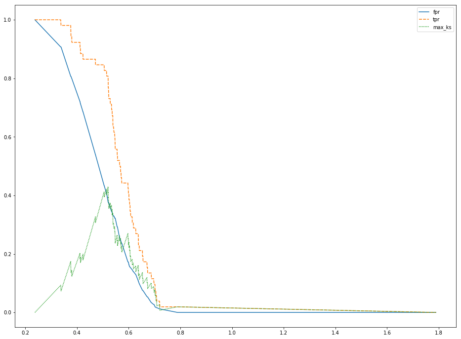

# 金融信用模型

便签：Xgboost

[TOC]

## 1、背景和目标

背景：对于投资者来说，需要预测借贷者无法偿还贷款的风险，最大程度地避免投资损失，最大程度地实现投资回报。如果借贷者顺利偿还贷款，投资者则获得利息收益。如果借贷者无法偿还贷款，投资者则损失贷款本金

目标：根据贷款记录数据构建机器学习模型，预测借贷者是否有信用问题

## 2、分析方法确定

- 该项目的预测问题为二分类问题，预测用户是否是“坏人”

- 特征未进行脱敏处理，可以利用业务知识对特征进行先处理后再进行常规特征工程

- 在金融领域，容易出现较严重的正负样本不平衡问题，且特征容易出现共线性的情况，因而使用GBRT作为本次问题的模型

## 3、定义target

```python
df_clean.loan_status.replace('Fully Paid', 0, inplace = True)
df_clean.loan_status.replace('Current', 0, inplace = True)
df_clean.loan_status.replace('Late (16-30 days)', 1, inplace = True)
df_clean.loan_status.replace('Late (31-120 days)', 1, inplace = True)
df_clean.loan_status.replace('Charged Off', 1, inplace = True)
df_clean.loan_status.replace('In Grace Period', np.nan, inplace = True)
df_clean.loan_status.replace('Default', np.nan, inplace = True)
df_clean.loan_status.value_counts(dropna = False)

df_clean.dropna(subset = ['loan_status'], inplace = True)
y = df_clean.loan_status
df_clean.drop('loan_status', axis = 1, inplace = True)
```

- 把已经还款和正在还款的客户定义为”好“客户，把逾期和已有征信危机的客户定义为“坏”客户

## 4、数据观察及预处理

### 4.1、清理id类数据以及行与列均为空值的数据

```python
df_clean = df.copy()
df_clean.drop('member_id', axis = 1, inplace = True)
df_clean.drop('id', axis = 1, inplace = True)
df_clean.dropna(axis = 0, how = 'all', inplace = True)
df_clean.dropna(axis = 1, how = 'all', inplace = True)
```

### 4.2、将缺失比例高于50%的特征删除

```python
missing_col = []
missing_col_nums = []
for col in df_clean.columns:
    missing_nums = round(len(df_clean[df_clean[col].isnull()].index) / len(df_clean), 5)
    if missing_nums:
        missing_col.append(col)
        missing_col_nums.append((col, missing_nums))
for i in sorted(missing_col_nums, key = lambda x: x[1], reverse = True):
    print(i)
    if i[1] >0.5:
        missing_col.remove(i[0])
        missing_col_nums.remove(i)
        df_clean.drop(i[0], axis = 1, inplace = True)
```

### 4.3、部分object数据处理为数值型

```
df_clean.emp_length.fillna(0, inplace = True)
df_clean.emp_length.replace(to_replace = '[^0-9]+', value = '', inplace = True, regex = True)
df_clean.emp_length = df_clean.emp_length.astype(int)

#将百分比数据处理成int型
df_clean.revol_util = df_clean.revol_util.str.replace('%', "").astype(float)
df_clean.int_rate = df_clean.int_rate.str.replace('%','').astype(float)
```

### 4.4、删除贷后特征

```python
df_clean.drop(['out_prncp','out_prncp_inv','total_pymnt',
         'total_pymnt_inv','total_rec_prncp', 'grade', 'sub_grade'] ,1, inplace=True)
df_clean.drop(['total_rec_int','total_rec_late_fee',
         'recoveries','collection_recovery_fee',
         'collection_recovery_fee' ],1, inplace=True)
df_clean.drop(['last_pymnt_d','last_pymnt_amnt',
         'next_pymnt_d','last_credit_pull_d'],1, inplace=True)
df_clean.drop(['policy_code'],1, inplace=True)
```

### 4.5、数值型特征分析

#### 4.5.1、删除标准差小于1.5的数值型特征

```python
df_clean.select_dtypes(include = ['float']).describe().T.sort_values(by = 'std')

float_col = list(df_clean.select_dtypes(include = ['float']).columns)
for col in float_col:
    if df_clean[col].std() <= 1.5:
        df_clean.drop(col, axis = 1, inplace = True)
```

#### 4.5.2、检查是否有特征完全与label不相关

```python
corr_target = []
for col in df_clean.select_dtypes(exclude = ['object']).columns:
    corr = np.corrcoef(df_clean[col].fillna(df_clean[col].median()), y)[0][1]
    corr_target.append((col, corr))

for i in sorted(corr_target, key = lambda x: abs(x[1]), reverse = False):
    print(i)
```

```python
df_clean['label'] = y
plt.figure(figsize = (32, 24))
sns.heatmap(df_clean.corr().round(5), annot = True, cmap = 'RdBu')
df_clean.drop('label', axis = 1, inplace = True)
```



- 通过图像暂未发现有***完全不相关***的特征

#### 4.5.3、相关性较强特征剔除

```
cor = df_clean.corr()
cor.loc[ : , : ] = np.tril(df_clean.corr().round(5), k = -1)
cor = cor.stack()
cor_set = set()
for index in cor[(cor > 0.8)| (cor < -0.8].index:
    cor_set.add(index[0])
for col in cor_set:
    df_clean.drop(col, axis = 1, inplace = True)
    
plt.figure(figsize = (32, 24))
sns.heatmap(df_clean.select_dtypes(exclude = ['object']).corr().round(2), / 
annot = True, cmap = 'RdBu')
```



#### 4.5.4、数据分布可视化

```python
k = 0
plt.figure(figsize = (32, 24))
for col in df_clean.select_dtypes(exclude = ['object']).columns:
    k += 1
    plt.subplot(7, 10, k)
    plt.ylabel('Counts')
    sns.distplot(df_clean[col].dropna(), kde = False)
```



- 数值型数据分布不是正态分布，后续填充空值时使用中值进行填充，保证分布不被改变

### 4.6、Object型特征分析

#### 4.6.1、将object型数据取值个数超过50的特征删除

```python
object_list = []
object_col = []
for col in df_clean.select_dtypes(include = 'object').columns:
    object_list.append((col, len(df_clean[col].unique())))
    object_col.append(col)
for i in sorted(object_list, key = lambda x: x[1], reverse = True):
    print(i)
    if i[1] >= 50:
        object_list.remove(i)
        object_col.remove(i[0])
        df_clean.drop(i[0], axis = 1, inplace = True)### 4.10、总体缺失数据的相关性分析
```

#### 4.6.2、数据分布可视化

```python
df_clean_object = df_clean.select_dtypes(include = ['object']).copy()
df_clean_object.fillna('missing', inplace = True)

k = 0
plt.figure(figsize = (64, 12))
for col in df_clean_object.columns:
    val = df_clean_object[col].value_counts()
    k += 1
    plt.subplot(4, 3, k)
    names = list(val.index)
    counts = list(val.values)
    data = pd.DataFrame({'names': names, 'counts': counts})
    plt.title(col)
    sns.barplot(x = names, y = counts, data = data)
```



```python
lean.drop(['application_type', 'pymnt_plan'], axis = 1, inplace = True)
```

### 4.7、总缺失数据的相关性可视化



- mo_sin_old_il_acct与mths_since_rcnt_il的缺失情况完全正相关，后续需要为其构建特征
- mths_since_recent_bc与bc_open_to_buy的缺失情况正相关，后续需要为其构建特征

## 5、特征处理

### 5.1、特征构建

- 根据数据的缺失情况构建新特征

```python
df_clean['col_miss_1'] = np.zeros(df_clean.shape[0])
df_clean['col_miss_2'] = np.zeros(df_clean.shape[1])

df_clean.loc[df_clean['mo_sin_old_il_acct'].isnull(), 'col_miss_1'] += 1
df_clean.loc[df_clean['mths_since_rcnt_il'].isnull(), 'col_miss_1'] += 1
df_clean.loc[df_clean['mths_since_recent_bc'].isnull(), 'col_miss_2'] += 1
df_clean.loc[df_clean['bc_open_to_buy'].isnull(), 'col_miss_2'] += 1
```

### 5.2、字符型数据Onehotencoding

```python
df_clean = pd.get_dummies(df_clean)
```

### 5.3、数值型特征空值填充

```python
from sklearn.impute import SimpleImputer as imputer

impute = imputer(strategy = 'median')
df_clean.iloc[ :, : ] = impute.fit_transform(df_clean)
```

## 6、构建模型

### 6.1、划分训练集和测试集

```python
from sklearn.model_selection import train_test_split as tts

X_train, X_test, y_train, y_test = tts(df_clean, y, test_size = 0.2, 
                                       random_state = 2019, stratify = y)
```

### 6.2、使用xgboost.cv进行调参

```python
import xgboost as xgb

dtrain = xgb.DMatrix(X_train, y_train)
dtest = xgb.DMatrix(X_test, y_test)

param = {'verbosity': 1,
         'objective': 'binary:logistic',
         'stratified': True,
         'max_depth': 1,
         'subsample': 0.8,
         'eta': 0.1,
         'gamma': 0,
         'lambda': 4,
         'alpha': 0,
         'scale_pos_weight': 20,
         'min_child_weight': 5,
         'max_delta_step': 0.5,
         'base_score': 0.05,
         'colsample_bytree': 0.6,
         'colsample_bynode': 0.4,
         'colsample_bylevel': 0.4,
         'seed': 2019,
         'eval_metric': 'auc',
         'nfold': 4}
num_round = 1000
pred_cv = xgb.cv(param, dtrain, num_round, nfold = 4, verbose_eval = False)
print(pred_cv.tail())

plt.figure(figsize = (12, 6))
sns.lineplot(data = pred_cv.drop(['train-error-std', 'test-error-std'], axis = 1))
```



将num_round设为150

### 6.3、按调好的参数进行训练和预测

```python
dtrain = xgb.DMatrix(X_train,  y_train)
dtest = xgb.DMatrix(X_test, y_test)

param = {'verbosity': 1,
         'objective': 'binary:logistic',
         'stratified': True,
         'max_depth': 1,
         'subsample': 0.8,
         'eta': 0.1,
         'gamma': 0,
         'lambda': 4,
         'alpha': 0,
         'scale_pos_weight': 20,
         'min_child_weight': 5,
         'max_delta_step': 0.5,
         'base_score': 0.05,
         'colsample_bytree': 0.6,
         'colsample_bynode': 0.4,
         'colsample_bylevel': 0.4,
         'seed': 2019,
         'eval_metric': 'auc',
         'nfold': 4}
num_round = 150

bst = xgb.train(param, dtrain, num_round)

pred = bst.predict(dtest)
```

- 使用scale_pos_weight和base_score可以减少迭代次数

### 6.4、计算KS系数

```python
y_pred = pred.copy()
y_pred[y_pred > 0.5] = 1
y_pred[y_pred != 1] = 0

print('AUC is ', auc(y_test, y_pred))
print('Recall_rate is ', recall(y_test, y_pred))
print('Logloss is', log_loss(y_test, pred))

fpr, tpr, threadshold = roc_curve(y_test, pred)
ks = max(tpr - fpr)
print('KS系数为', ks)

plt.figure(figsize = (16,12))
sns.lineplot(data = pd.DataFrame({'fpr': fpr, 'tpr': tpr, 'max_ks': tpr - fpr},
                                 index = threadshold))
```



项目结果：KS系数为0.42